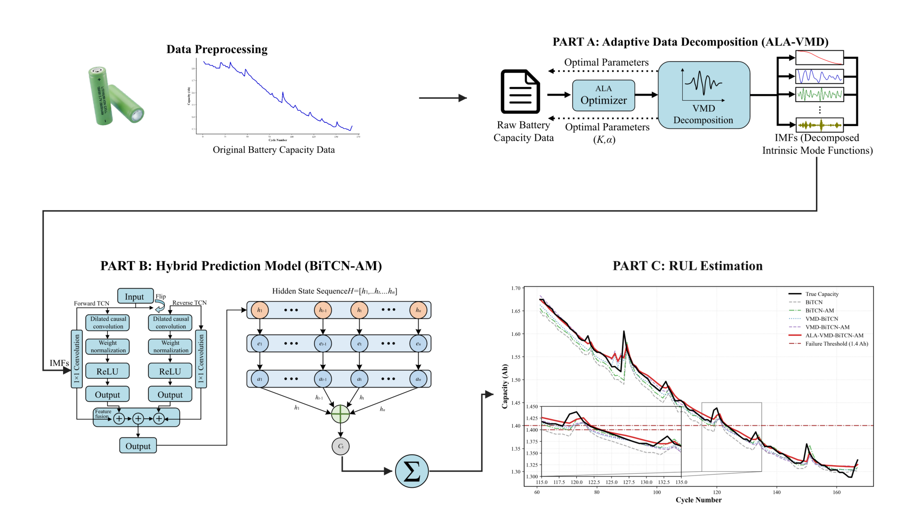

# ALA–VMD–BiTCN–AM

**Optical-sensing-oriented remaining useful life estimation of lithium-ion batteries using ALA-tuned VMD and a BiTCN-AM model**

Qiushi Xie · Huazhong University of Science and Technology

In *Proceedings of SPIE*, 2026 · Volume 14327 · Article 143271X.

[Paper / DOI](https://doi.org/10.1117/12.3122481) · [Project website](https://qiushi0919.cn/battery-rul/) · [GitHub Pages](https://qiushi0919.github.io/ALA-VMD-BiTCN-AM/) · [BibTeX](docs/assets/battery-rul.bib)



## What is included

- The five saved Python model scripts in `code/legacy/`.
- Experiment-ready NASA B0005 and CALCE CS2_38 capacity sequences and saved ALA–VMD / VMD decompositions in `data/`.
- Saved predictions for five model variants and both batteries in `results/`.
- A standard-library evaluator that verifies dataset alignment and recomputes RMSE, MAE, R² and threshold-crossing indices.
- A white, Times New Roman project website, four method figures and a silent animated method demonstration in `docs/`.

This is a release of the available experiment artifacts. ALA parameter-search source/logs and trained model weights were not present in the supplied experiment directory and are not included. Saved results can be checked immediately; this repository does not claim complete end-to-end retraining reproducibility. See [reproduction notes](REPRODUCTION.md).

## Verify the saved experiments

Python 3, no third-party packages required:

```sh
python3 code/evaluate_saved_results.py
python3 code/evaluate_saved_results.py --output local_reports/metrics.json
```

The evaluator checks SHA-256 against `source_manifest.json`, confirms that decomposition capacity columns match the capacity files, and verifies the target indices of all ten result CSVs before reporting metrics. It never trains a model or overwrites a supplied result.

For historical training dependencies and execution caveats, see [code/legacy/README.md](code/legacy/README.md). The legacy scripts start training when executed; they are not imported by the evaluator.

## Website

Edit `website/index.html`, `website/styles.css` or `website/site.js`, then run:

```sh
python3 code/build_website.py
python3 -m http.server 8000 --directory docs
```

GitHub Pages serves the `docs/` directory on `main`. Method figures use one full-width column on desktop and phones. All four figures can be enlarged. Media are maintained in `docs/assets/`.

## Data and citation

The capacity CSVs are the experiment's extracted capacity sequences, not the complete upstream NASA or CALCE archives. Dataset providers, column schemas and row-index conventions are documented in [data/README.md](data/README.md). Upstream data remain subject to their providers' terms and attribution requirements. No new blanket license is asserted for third-party datasets.

Please cite the paper through its DOI and use the [BibTeX file](docs/assets/battery-rul.bib).
